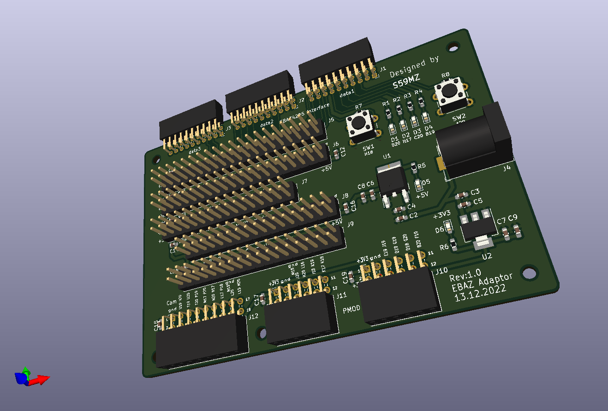
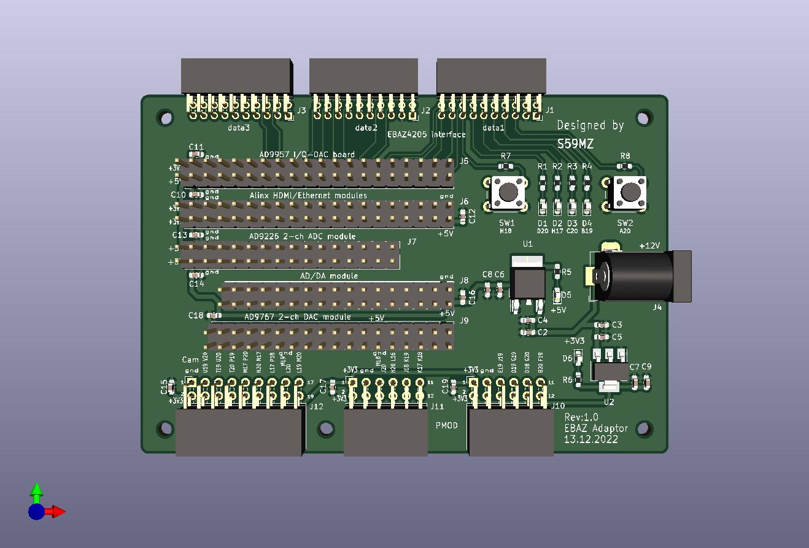
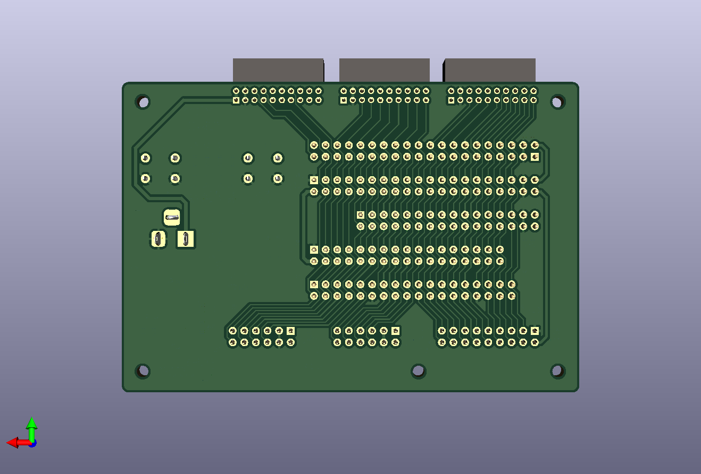

# ebaz_adaptor
Adapter board from the EBAZ FPGA board to multiple Alinx modules and PMOD interfaces

Schematic:
[ebaz_adaptor.pdf](ebaz_adaptor.pdf)

BOM:
[ebaz_adaptor.csv](ebaz_adaptor.csv)

Gerbers:
[gerbers.zip](https://github.com/s59mz/kicad-EBAZ_adaptor/raw/main/gerbers.zip)
